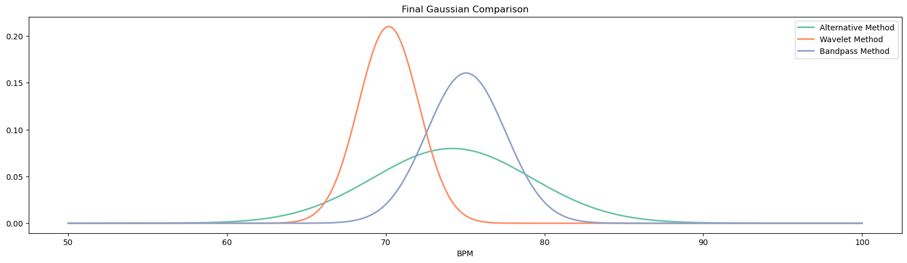

# HeartRateEstimation

## The context 
This is the final project for the "Laboratory of computational physics (MOD. A)" course in "Physics of Data" master program, University of Padua.
Authors: [Paolo Lapo Cerni](https://github.com/paololapo), [Jacopo Carotenuto](https://github.com/jacopocarotenuto), [Lorenzo Vigorelli](https://github.com/LorenzoVigorelli), [Arman Singh Bains](https://github.com/T3X3K)

## The project
The goal of this project is to estimate the heart rate of an healthy subject, given linear acceleration and angular velocity measurements recorded by using the MuSe platform.  
Seismocardiography([SCG](https://www.ncbi.nlm.nih.gov/pubmed/24111357)) is a very promising technique to measure Heart Rate (HR) and Respiratory Rate (RR) with the detector positioned above sternum. It is generally based on accelerometer and gyroscope readings or a combination of them.  
Ballistocardiography([BCG](https://en.wikipedia.org/wiki/Ballistocardiography)) is an another technique to estimate heart and respiratory rate with combination of both accelerometer and gyroscope. It is an indirect evaluation of HR and RR since the contact between the device and the body of the subject is not required (e.g., accelerometer platform mounted under the slats of the bed).

There are two txt files, from which we import the data: ```center_cernum.txt``` and ```4_Chest-sweater.txt```.
The first one include the data detected from a sensor placed on a bed stave, under the mattress at the level of the chest, while the subject was lying supine on his left and right side.
Instead the second include the data detected from a sensor placed on the subject chest directly on a sweater.  

### Table of Content
1. [Introduction](#introduction)
2. [Preparing the Dataset](#preparing-the-dataset)

	2.1 [Data Loading and Calibration](#data-loading-and-calibration)

	2.2 [Sample Rate Analysis](#sample-rate-analysis)

	2.3 [Showcasing the Data](#showcasing-the-data)

3. [Statistical Analysis](#statistical-analysis)

	3.1 [Dimensionality Reduction](#dimensionality-reduction)

4. [Discrete Fourier Transform](#discrete-fourier-transform)

	4.1 [Passband Filter](#passband-filter)

	4.1 [Gaussian Filter](#gaussian-filter)

5. [Wavelet Transform](#wavelet-tranform)

	5.1 [Peaks Analysis](#peaks-analysis)

6. [Alternative Methods](#alternative-method)

	6.1 [Subtracting the Baseline](#subtracting-the-baseline)

	6.2 [Finding the Peaks](#finding-the-peaks)

	6.3 [Gaussian Fitting](#gaussian-fitting)

	6.4 [Respiratory Rate](#respiratory-rate-estimation)

7. [Conclutions](##Conclutions)

We all contributed equally in achieving the results, working simultaneously on the several parts of the projects.
Obviouly different people worked more on different parts as explained in this list:
- Paolo Lapo: focused on developing the filters
- Jacopo Carotenuto: focused on peaks analysis
- Lorenzo Vigorelli: focused on data cleaning and graphical rerpresentation
- Arman Singh Bains: focuded on the statistical analysis

<br>
<br>

In this image are shown the final results for the BPM analysis.
<br>

<p align="center">

</p>